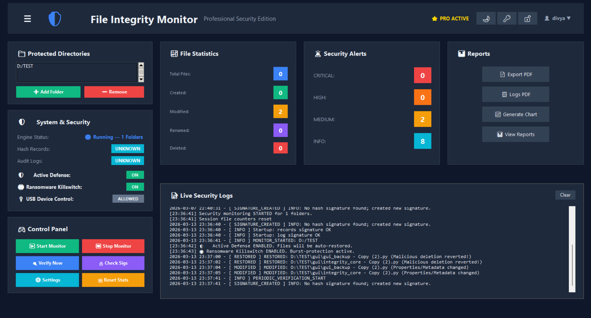
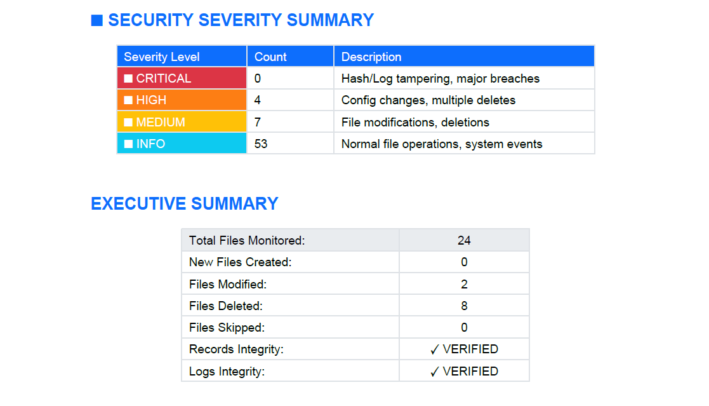
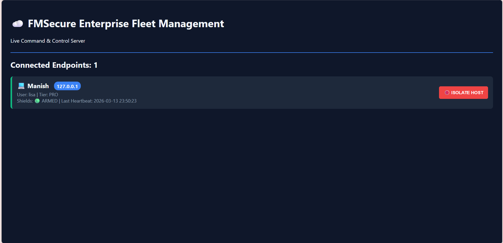
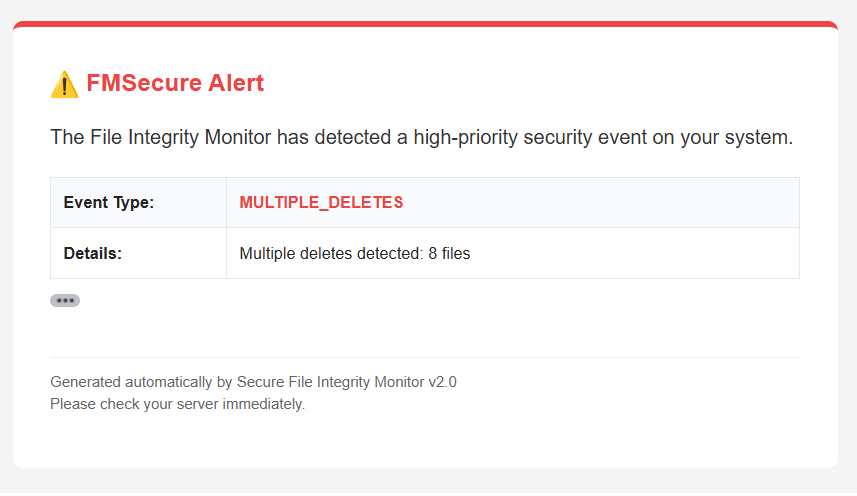

# 🛡️ FMSecure: Enterprise Endpoint Detection & Response (EDR)


[]()

**FMSecure** is a production-ready Endpoint Detection and Response (EDR) agent and Command & Control (C2) architecture. Built entirely in Python, it provides real-time file system monitoring, cryptographic tamper detection, active ransomware defense, and live cloud telemetry.

---

## 📸 System Overview




---

# 🚀 Core Enterprise Features

## 1. 🔍 File Integrity Monitoring
- Cryptographic hashing (SHA-256)
- Detects **Created / Modified / Deleted / Renamed / Moved / changing any attributes** files
- Real-time monitoring using watchdog

---

## 2. 🚨 Severity Intelligence
- INFO — File created  
- MEDIUM — File modified  
- HIGH — Multiple deletions  
- CRITICAL — Hash database or log tampering 

---

## 3. 👤 Authentication & Access Control
- User Mode (read-only, safe)
- Admin Mode (full control)
- Admin login alerts
- Password change logging

---

## 4. 📊 Reporting & Visualization
- Summary & detailed reports
- PDF export with charts
- Incident snapshot generation
- Log archive & history system



---

## 5. 🛑 Ransomware Killswitch & Behavioral Heuristics
Monitors file system I/O for rapid burst modifications indicative of ransomware encryption. Upon threshold breach, it dynamically executes Windows `icacls` commands to instantly revoke OS-level Write/Delete permissions across all monitored directories, halting the attack in milliseconds.

---

## 6. 🛡️ Active Defense & Cryptographic Vault
Automatically backs up critical files into a hidden, local AES-encrypted vault using Fernet symmetric cryptography. If unauthorized modifications or deletions are detected, the system automatically restores the clean file from the vault and alerts the administrator.

---

## 7. ☁️ Command & Control (C2) Fleet Management
Features an asynchronous FastAPI cloud server that receives live telemetry (Heartbeats) from local desktop agents. IT Administrators can view the live status of all endpoints and execute **Remote Network Lockdowns** to isolate compromised hosts from a web browser.




---

## 8. 🔌 Data Loss Prevention (DLP)
Prevents unauthorized data exfiltration by enforcing USB Read-Only policies. The agent interacts directly with the Windows Registry (`StorageDevicePolicies`) to lock down hardware ports during high-alert scenarios.

---

## 9. 👻 Self-Healing Watchdog Process
The core agent is wrapped in an invisible, unkillable Watchdog process masquerading as a native Windows service (`WinSysHost.exe`). If a threat actor attempts to terminate the EDR via Task Manager, the Watchdog instantly resurrects the agent in "Recovery Mode" and forces it into the System Tray.

---

## 10. 🔄 OAuth 2.0 Cloud Sync
Integrates directly with the Google Drive API to securely stream encrypted AES backups off-site, ensuring data recovery is possible even if the local disk is entirely compromised or physically destroyed.

---

# 🏗️ Technical Architecture

- **The Local Agent:** A multi-threaded Python application utilizing `watchdog` for file I/O interception, `cryptography.fernet` for local vaulting, and HMAC SHA-256 for audit log integrity.

- **The Telemetry Engine:** An asynchronous background daemon that queues JSON payloads and streams endpoint status to the C2 server every 10 seconds.

- **The C2 Server:** A high-performance `FastAPI` + `Uvicorn` asynchronous backend utilizing `Pydantic` for strict data validation and payload routing.

- **Deployment:** Packaged as a standalone Windows executable using `PyInstaller` (with UAC Admin manifests) and wrapped into a professional `.exe` installer via `Inno Setup`.

---

# 🚨 Threat Response in Action




---

# 🛠️ Installation & Build Guide

## 1️⃣ Run from Source

```bash
# Clone the repository
git clone https://github.com/Manish93345/FileIntegrityChecker.git

cd FMSecure

# Install dependencies
pip install -r requirements.txt

# Run the C2 Cloud Server
cd FMSecure_Cloud
uvicorn server:app --reload

# Run the Local Agent (in a new terminal)
python run.py
```

---

## 2️⃣ Compile to Enterprise Executable (Windows)

To build the standalone EDR agent with elevated OS privileges and the stealth Watchdog:

```powershell
# Compile the invisible Watchdog
pyinstaller --onedir --noconsole --name WinSysHost sys_watchdog.py

# Compile the Main Agent (Requires Admin UAC)
pyinstaller run.py --onedir --noconsole --name SecureFIM --icon=assets/icons/app_icon.ico --uac-admin --clean --add-data "credentials.json;."
```

After compilation, use the provided **setup_config.iss** in **Inno Setup** to generate the final deployment installer.

---

# 🔮 Future Scope (Active Development)

- **Network Isolation:** Integration with Windows `netsh advfirewall` to physically sever LAN connections during a Killswitch event.

- **Machine Learning Heuristics:** Replacing static burst-thresholds with an isolation forest ML model to detect anomalous file I/O behavior.

- **Memory Scanning:** API hooking to detect fileless malware executing directly in RAM.

---

## 👨‍💻 Author

Developed by **Manish** as a comprehensive study in **Systems Architecture, OS-Level Permissions, and Enterprise Cybersecurity**.